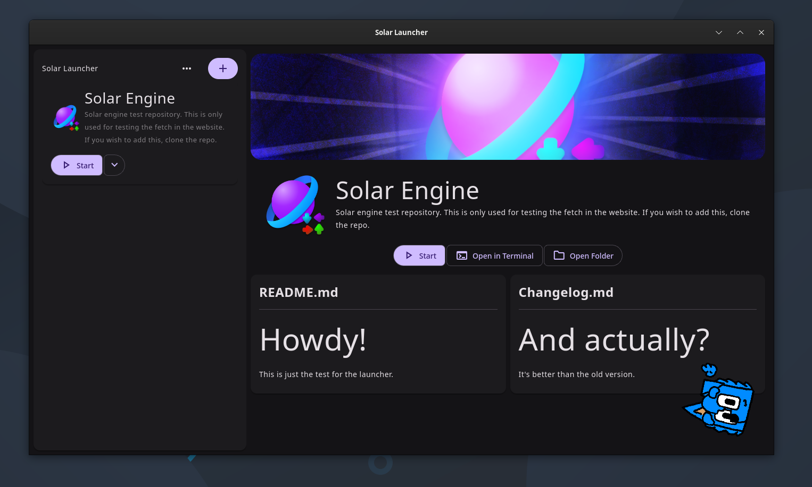

# Solar Launcher
A fork of [AppShortsies](https://github.com/daveberrys/appshortsies) made for Solar Engine, Solar Website, and FNF exectuables because we're not only restricting it to only solar engine. Available for **Windows**, **macOS**, and **Linux**.

## Development Phase
Check out our [discord server](https://discord.gg/RaHmP5fgyA) for our development updates. Every commit or every development phase will be there, (almost) every time we make a change.

## Downloads
You can get the **latest stable version** of Solar Launcher [here](https://github.com/Team-SolarEngine/solar-launcher/releases).

If you want **nightly**, here's the link for each platform.
- [solarlauncher-macos-latest-aarch64-apple-darwin](https://nightly.link/Team-SolarEngine/solar-lanucher/workflows/build.yaml/main/solarlauncher-macos-latest-aarch64-apple-darwin.zip)
- [solarlauncher-macos-latest-x86_64-apple-darwin](https://nightly.link/Team-SolarEngine/solar-lanucher/workflows/build.yaml/main/solarlauncher-macos-latest-x86_64-apple-darwin.zip)
- [solarlauncher-ubuntu-latest-x86_64-unknown-linux-gnu](https://nightly.link/Team-SolarEngine/solar-lanucher/workflows/build.yaml/main/solarlauncher-ubuntu-latest-x86_64-unknown-linux-gnu.zip)
- [solarlauncher-windows-latest-x86_64-pc-windows-msvc](https://nightly.link/Team-SolarEngine/solar-lanucher/workflows/build.yaml/main/solarlauncher-windows-latest-x86_64-pc-windows-msvc.zip)

# License
This project is licensed under the MIT License. See the [LICENSE](LICENSE) file for details.
