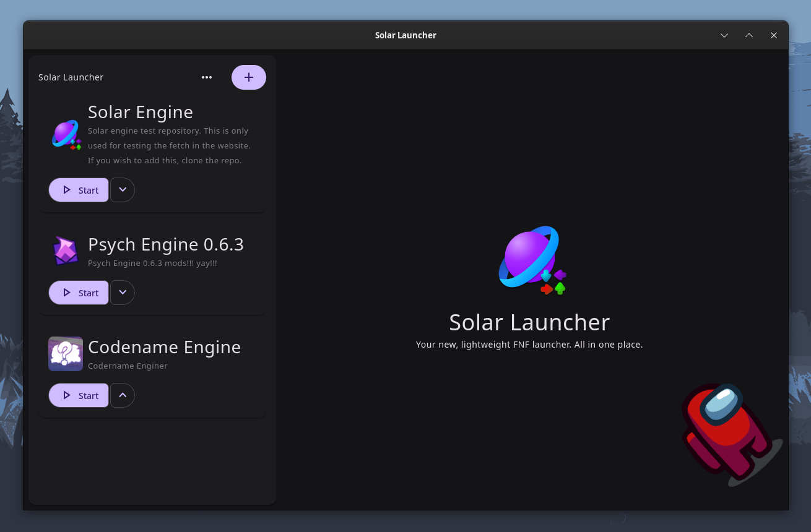
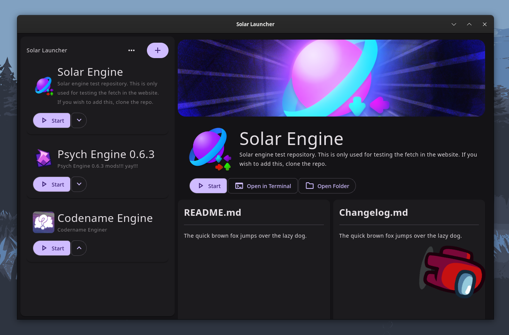
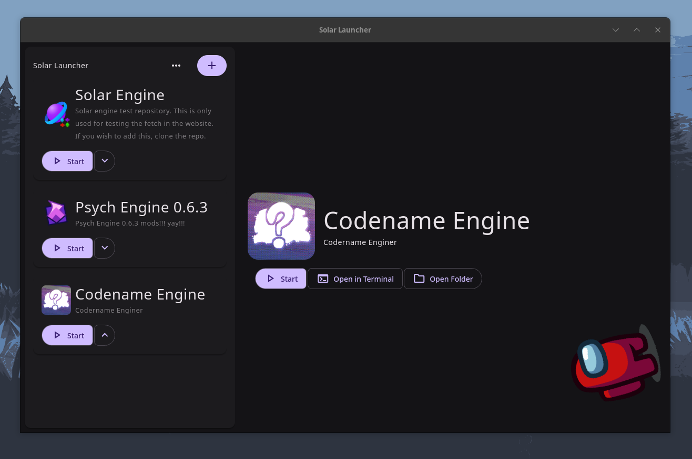
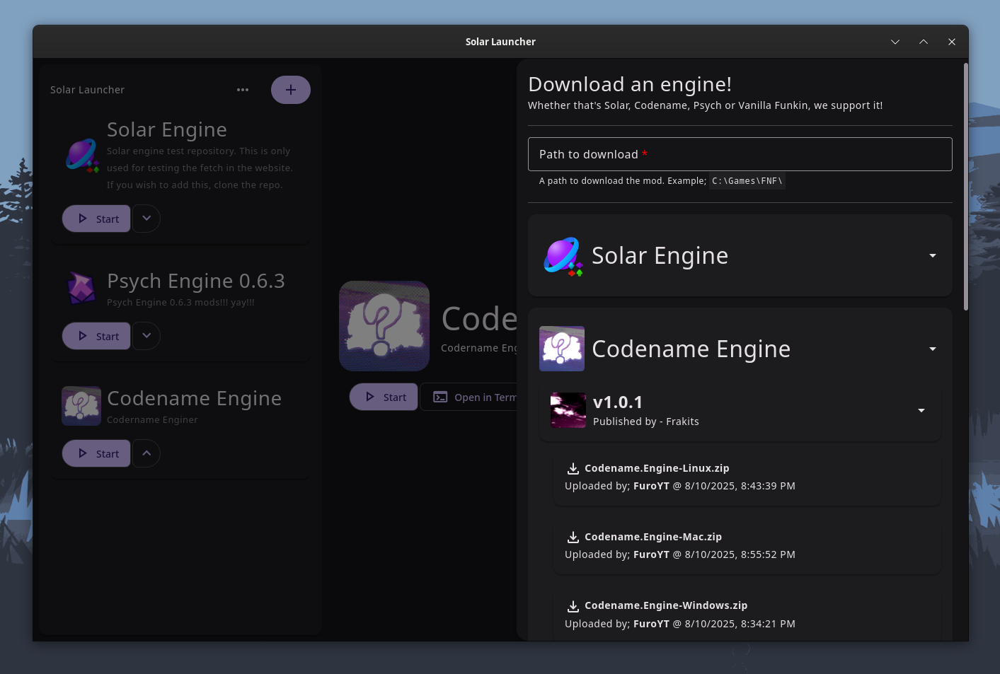
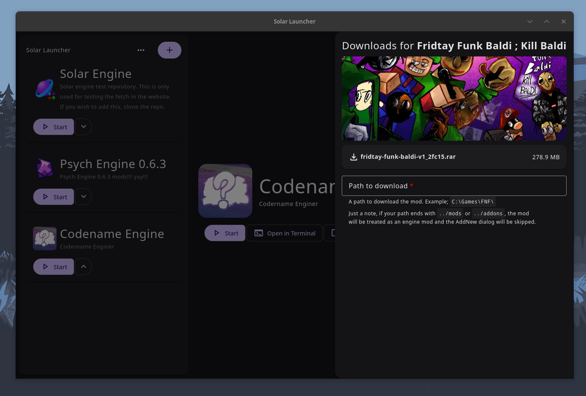
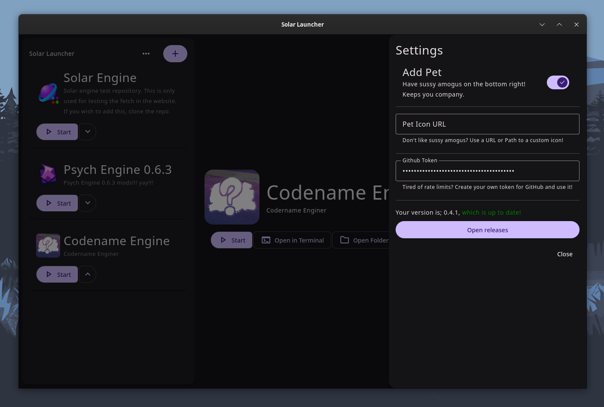

# Solar Launcher
A fork of [AppShortsies](https://github.com/daveberrys/appshortsies) made for launching FNF and non-FNF executable. Available for **Windows**, **macOS**, and **Linux**.

# Preview
> These screenshots may be outdated. But nontheless, still the same interface.

<table align="center">
    <tr>
        <td style="width: 50%;">
            
            Empty Screen
        </td>
        <td style="width: 50%;">
            
            Main Content with banner, README and Changelog
        </td>
    </tr>
    <tr>
        <td style="width: 50%;">
            
            Main Content without banner, README and Changelog
        </td>
        <td style="width: 50%;">
            
            Download an engine in the launcher
        </td>
    </tr>
    <tr>
        <td style="width: 50%;">
            
            GameBanana Integration with Deeplinks
        </td>
        <td style="width: 50%;">
            
            Settings Menu
        </td>
    </tr>
</table>

# Development Phase
Check out our [discord server](https://discord.gg/RaHmP5fgyA) for our development updates. Every commit or every development phase will be there, (almost) every time we make a change.

# Downloads
You can get the **latest stable version** of Solar Launcher [here](https://github.com/Team-SolarEngine/solar-launcher/releases). We recommend you to download the latest stable version.

If you want **nightly**, here's the link for each platform.
- [solarlauncher-macos-latest-aarch64-apple-darwin](https://nightly.link/Team-SolarEngine/solar-lanucher/workflows/build.yaml/main/solarlauncher-macos-latest-aarch64-apple-darwin.zip)
- [solarlauncher-macos-latest-x86_64-apple-darwin](https://nightly.link/Team-SolarEngine/solar-lanucher/workflows/build.yaml/main/solarlauncher-macos-latest-x86_64-apple-darwin.zip)
- [solarlauncher-ubuntu-latest-x86_64-unknown-linux-gnu](https://nightly.link/Team-SolarEngine/solar-lanucher/workflows/build.yaml/main/solarlauncher-ubuntu-latest-x86_64-unknown-linux-gnu.zip)
- [solarlauncher-windows-latest-x86_64-pc-windows-msvc](https://nightly.link/Team-SolarEngine/solar-lanucher/workflows/build.yaml/main/solarlauncher-windows-latest-x86_64-pc-windows-msvc.zip)

# Features
## Drag n' Drop
Drag and drop mods. Either that's from a non-engine or a engine. Select if you want to pick a folder or select one of the instance you have.

## Supports any executable
Literally supports any executables. This gives you flexibility for... something I guess? We don't have any advantages on this, other than running for bottles or wine in Linux.

## Cross Platform
This is probably obvious, but we support desktop cross platform for <u>Windows</u>, <u>Linux</u>, and <u>macOS</u>. No, Android will not come soon. iOS is a big massive no.

## Deep Links
Solar Launcher supports deeplinks, that means, you can install mods and whatnot directly to the launcher easily! To call it, just do solar-launch://gb-mods/{gamebanana-game-id}. We directly support GameBanana.

## In-App Engine Downloading
Leaving the Launcher just to get a specific launcher takes too long. We've made it where you can download Solar, Codename, Psych and Funkin directly in the launcher w/o leaving the launcher!

## Mods Section
Deleting and disabling mods are now easier than ever! Just click on a checkbox to toggle, and click on the trash button to delete that mod forever. There's also a folder button if you need it.

# License
This project is licensed under the MIT License. See the [LICENSE](LICENSE) file for details.
